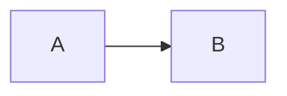

# GPT help (Svelte)

This is an implementation of the default [GPT help](https://github.com/microsoft/vscode-webview-ui-toolkit-samples/tree/main/default/gpt-help-extention) sample extension that demonstrates how to set up and use a [Svelte](https://svelte.dev/) + [Webview UI Toolkit](https://github.com/microsoft/vscode-webview-ui-toolkit) webview extension.


$f(x) = x^2$


## Documentation

For a deeper dive into how this sample works, read the guides below.

- [Extension structure](./docs/extension-structure.md)
- [Extension commands](./docs/extension-commands.md)
- [Extension development cycle](./docs/extension-development-cycle.md)

## Run The Sample

```bash
# Copy sample extension locally
npx degit microsoft/vscode-webview-ui-toolkit-samples/frameworks/gpt-help gpt-help-extention

# Navigate into sample directory
cd gpt-help-extention

# Install dependencies for both the extension and webview UI source code
npm run install:all

# Build webview UI source code
npm run build:webview

# Open sample in VS Code
code .
```

Once the sample is open inside VS Code you can run the extension by doing the following:

1. Press `F5` to open a new Extension Development Host window
2. Inside the host window, open the command palette (`Ctrl+Shift+P` or `Cmd+Shift+P` on Mac) and type `GPT help (Svelte): Show`
